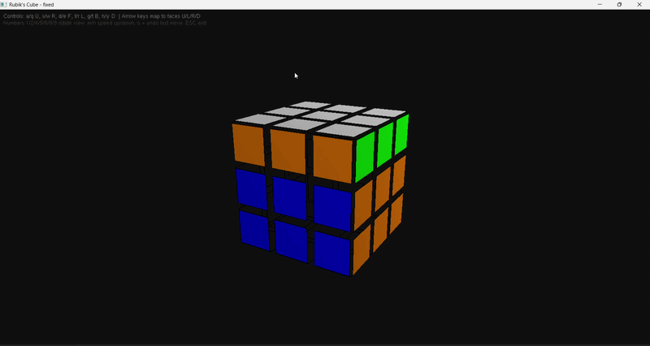
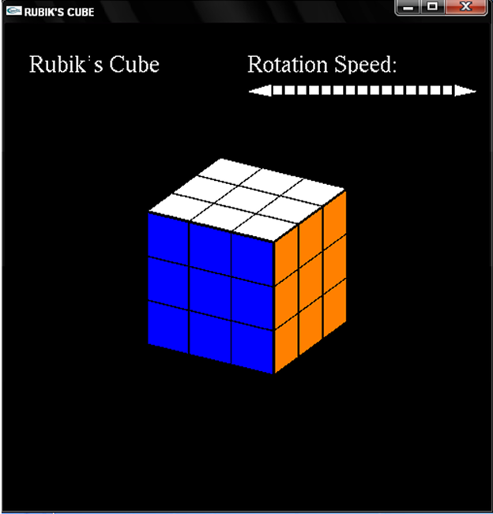
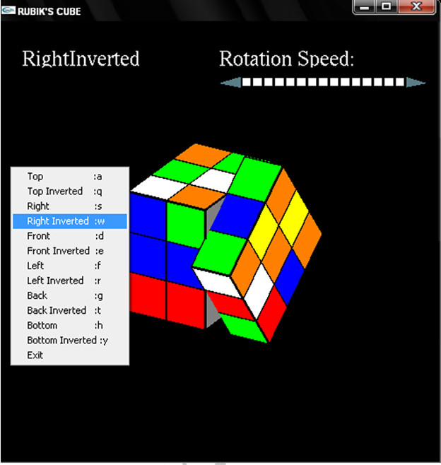
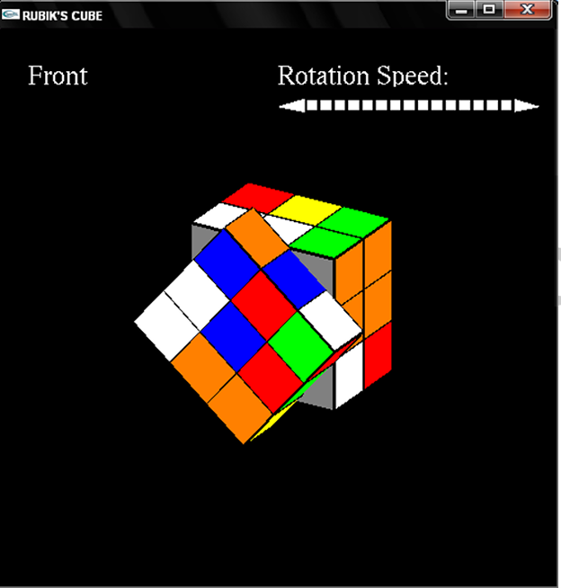

# 🧊 Rubik's Cube Simulator (C++ OpenGL)

A **3D Rubik's Cube Simulator** developed using **C++ and OpenGL (FreeGLUT)**. This program visually renders a **fully interactive Rubik's Cube** where users can rotate faces using keyboard inputs and view the cube in 3D.

The project demonstrates concepts from **Computer Graphics**, including:

- 3D transformations
- OpenGL rendering
- Matrix rotations
- Interactive input handling

---

# 📸 Demo

### 🎬 Program Output


---

# 📷 Screenshots

### Cube Interface


### Cube Rotation


### Different Cube Angle


---

# 🚀 Features

- 3D Rubik's Cube rendering
- Face rotation controls
- Mouse-based cube rotation
- Keyboard interaction
- Real-time color updates
- OpenGL graphics rendering
- GLUT window management

---

# 🎮 Controls

| Key | Action |
|----|------|
| A | Rotate Top Face |
| S | Rotate Right Face |
| D | Rotate Front Face |
| F | Rotate Left Face |
| G | Rotate Back Face |
| H | Rotate Bottom Face |
| Mouse Drag | Rotate cube view |
| ESC | Exit program |

---

# 🛠 Technologies Used

- **C++**
- **OpenGL**
- **FreeGLUT**
- **MinGW (GCC Compiler)**
- **Visual Studio Code**

---

# ⚙️ Installation Guide (Windows)

## 1️⃣ Install VS Code

Download from:

https://code.visualstudio.com/

Install extension:

```
C/C++ (Microsoft)
```

---

# 2️⃣ Install MinGW Compiler

Download MinGW GCC from:

https://winlibs.com/

Extract the archive to:

```
C:\Users\<username>\Downloads\mingw64
```

Example:

```
C:\Users\ragha\Downloads\mingw64
```

---

### Add MinGW to PATH

1. Open **Environment Variables**
2. Select **Path**
3. Click **Edit**
4. Add:

```
C:\Users\ragha\Downloads\mingw64\bin
```

Verify installation:

```
g++ --version
```

Expected output:

```
g++ (GCC) 15.x.x
```

---

# 3️⃣ Install FreeGLUT (OpenGL Toolkit)

Download FreeGLUT:

https://www.transmissionzero.co.uk/software/freeglut-devel/

Extract it to:

```
C:\Users\ragha\Downloads\freeglut
```

Important folders:

```
freeglut
│
├── include
│   └── GL
│       └── freeglut.h
│
├── lib
│   └── x64
│       └── freeglut.lib
│
└── bin
    └── x64
        └── freeglut.dll
```

---

### Add FreeGLUT DLL Path

Add to **Environment Variables → Path**

```
C:\Users\ragha\Downloads\freeglut\bin\x64
```

---

# 📂 Project Structure

```
RubixCube
│
├── rubic cube.cpp
├── cube.exe
├── freeglut.dll
│
├── screenshots
│   ├── 1.png
│   ├── 2.png
│   ├── 3.png
│   └── output.gif
│
└── README.md
```

---

# 🧑‍💻 Compilation

Open terminal in project folder and run:

```
g++ "rubic cube.cpp" -IC:\Users\ragha\Downloads\freeglut\include -LC:\Users\ragha\Downloads\freeglut\lib\x64 -lfreeglut -lopengl32 -lglu32 -o cube.exe
```

---

# ▶ Running the Program

Run:

```
.\cube.exe
```

A window titled **"RUBIK'S CUBE"** should appear displaying the 3D cube.

---

# 🧠 Concepts Demonstrated

This project demonstrates important **Computer Graphics topics**:

- 3D transformation matrices
- Rotation operations
- Object rendering
- Keyboard and mouse interaction
- OpenGL graphics pipeline

---

# 🔮 Future Improvements

Possible upgrades:

- Auto Rubik's Cube solver
- Scramble button
- Smooth animation transitions
- Lighting and shading
- Texture mapping
- GUI controls

---

# 👩‍💻 Author

**Iyer**

Computer Graphics Project

GitHub Repository:

```
https://github.com/Iyer2505/Rubix-Cube-Stimulator
```

---

# ⭐ Support

If you like this project, please give it a **star ⭐ on GitHub**.
